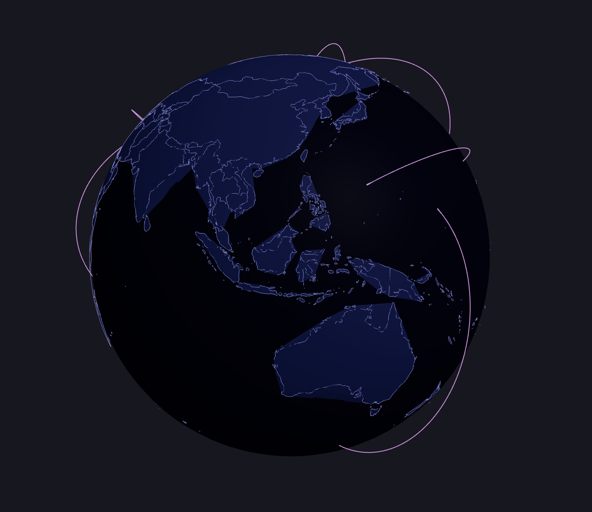
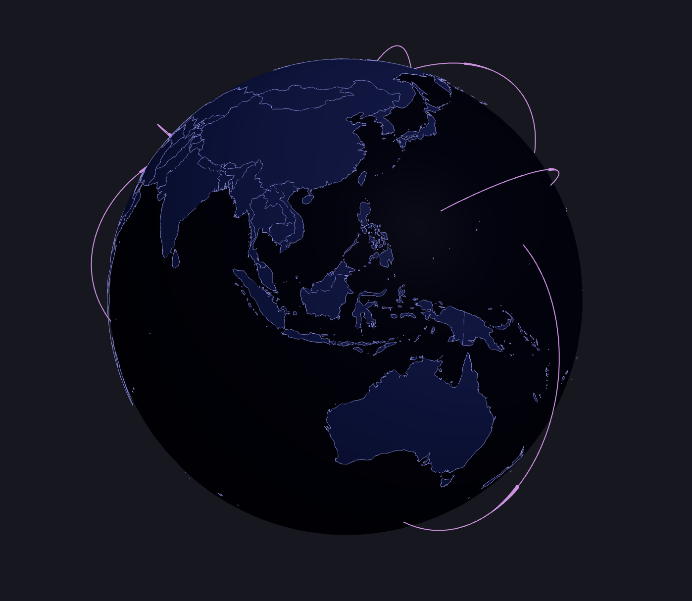
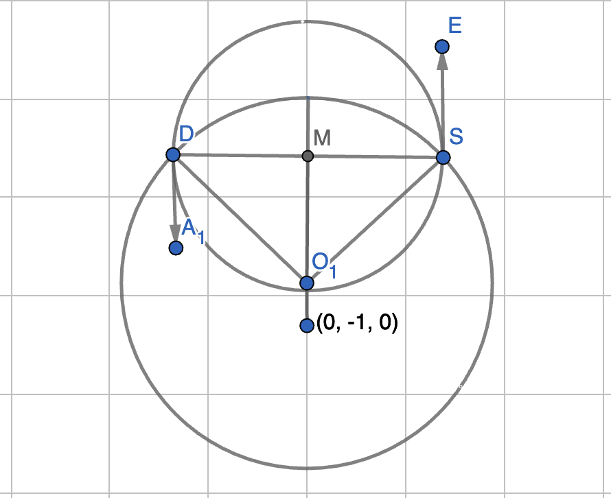

# 3D Earth

This project is inspired by the github project of [GlobeStream3D](https://github.com/hululuuuuu/GlobeStream3D), in particular the flyline feature. So the aims is to create a 3d earth with React Three Fiber to reproduce this interesting feature, also with possible optimizations.

## motivation of the project

- Interesting, learning is one of the main motivation
- Find it may be hard to integrate with React and maybe a bit difficult to use that library with my own customization, so it is better to dig into the source and try to understand it and custmize it as I prefer. Alway wanted my projects as much dependencies free as possible.

## Understanding the GeoJson Structure

GeoJson is used to generate earth map, you can find it in assets/world.json.

In geographic data, especially when dealing with polygons and multi-polygons, the structure is designed to handle various complexities such as holes in polygons (like lakes within a country) and multiple disjointed parts (like islands).

- Position: This is typically a pair (or tuple) of coordinates [x, y] (or [longitude, latitude] in geographic terms).

- Position[]: This represents a list of positions, which in the context of a polygon, forms a single linear ring (a closed loop). This linear ring can represent the outer boundary of the polygon or a hole within the polygon.

- Position[][]: This represents an array of linear rings. The first array is the outer boundary, and the subsequent arrays (if any) represent holes within the polygon. This structure is used for a single polygon, which might have an outer boundary and zero or more inner boundaries (holes).

- Position[][][]: This represents a collection of polygons. This structure is used when you have a MultiPolygon geometry, which consists of multiple polygons, each potentially having holes. A country that is represented by multiple disjoint polygons (e.g., an archipelago) requires Position[][][] because each polygon might have its own set of rings (outer boundary and possible holes).

## Delaunator

[Delaunator](https://www.npmjs.com/package/delaunator) is an efficient way to do generate triangles given a array of positions.
In this project it need to be further processed in order to get rid of the triangles outside of the boundary.

Below are screenshots of 2 results one with just Delaunator on the left, and other one with both process on the right.

<table>
  <tr>
    <td  align="center"><sub><b>only Delaunator</b></sub></td>
    <td  align="center"> <sub><b>both processes</b></sub></td>
  </tr>
</table>

## Helper Section

This section aims for explain some complex part of the project's code.

flyline section is a bit hard to understand by only watching the code. So let me show some additional info here.

1.  iterate through all the flyLineData
2.  convert each start and end coordinates to the corresponding 3d position
3.  \_3Dto2D function converts the 3d problem to 2d problem by rotating the start vector and end vector such that the middle vector of the two lies on y-axis and also the 3 vectors has z = 0, inthis way the three vector lies on the xoy plane.
4.  the createMesh function will create the flyline mesh in the 2d plane, following is the figure to faciliate the understanding of the fucntion logic, where D is the destination point, S the starting point, M is the middle point, O is the origin of the sphere, (0, -1, 0) for the new Vector3(0,-1,0) in the function.

 <table>
   <tr>
     <td  align="center"></td>
   </tr>
</table>

5.  the final result is obtained by rotating the output mesh with inverse quaternion back to the original space (flyLineMesh.quaternion.multiply(quaternion))
    ```javascript
    flyLineMesh.quaternion.multiply(quaternion);
    ```
